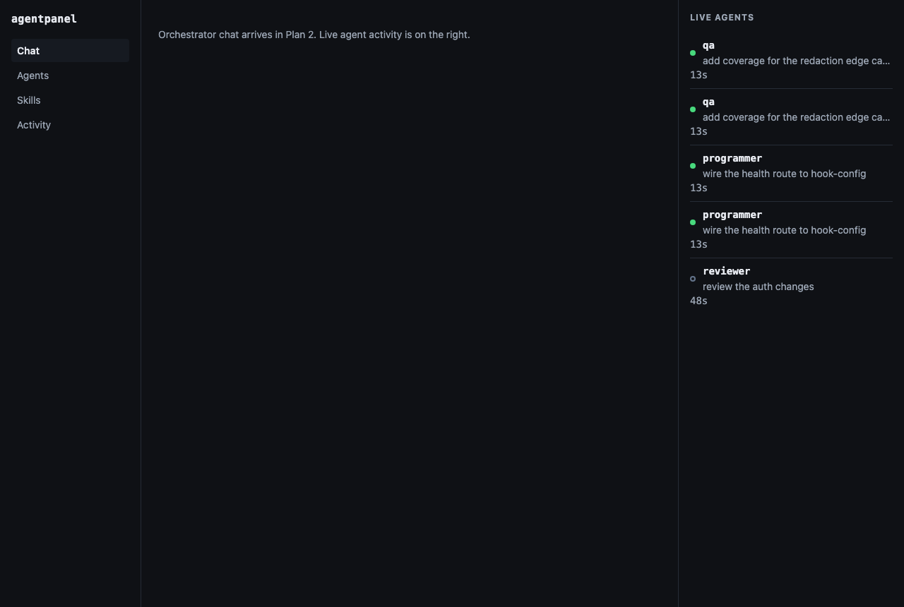

# agentpanel

A local dashboard for [Claude Code](https://docs.claude.com/en/docs/claude-code): it watches every
Claude Code session on your machine through hooks, and shows subagents as they dispatch and finish
in a live rail, alongside a catalog of every agent and skill available to you — with the scope
(user, project, or plugin) each one comes from.



## Install

```
npx agentpanel init
```

`init` prints exactly what it is about to change — which hook events it will add to
`~/.claude/settings.json` and nothing else — and writes nothing until you confirm:

```
npx agentpanel init --yes
```

It backs up your existing `settings.json` to `settings.json.agentpanel-backup` before writing.
From the next Claude Code session onward (in any directory whose workspace trust prompt you have
accepted — see below), the daemon starts itself and `agentpanel open` shows the dashboard.

To remove everything `init` added:

```
npx agentpanel uninstall
```

`uninstall` restores `settings.json` to its pre-install state (aside from formatting) and deletes
the state directory — the daemon's runtime file, its log, and its database — leaving no trace on
disk.

## Commands

| Command                | What it does                                                          |
|-------------------------|------------------------------------------------------------------------|
| `agentpanel init`       | Installs the five hooks that feed the dashboard. Requires `--yes` to write. |
| `agentpanel start`      | Starts the daemon by hand (normally the `SessionStart` hook does this). |
| `agentpanel stop`       | Stops the running daemon.                                             |
| `agentpanel status`     | Reports whether a daemon is running, and on which port.                |
| `agentpanel open`       | Opens the dashboard in your default browser.                          |
| `agentpanel uninstall`  | Removes the hooks, the state directory, and the database.             |

## Security

- The daemon binds `127.0.0.1` only, and every route except `/api/health` requires a bearer token
  read from a `0600` file. It is never reachable from the network, on purpose.

- **Hooks run shell commands with your full user permissions.** This is Claude Code's own warning,
  not ours, and it is worth repeating in full:

  > Command hooks execute shell commands with your full user permissions. They can modify, delete,
  > or access any files your user account can access. Review and test all hook commands before
  > adding them to your configuration.

  `agentpanel init` installs exactly two scripts (`hooks/agentpanel-hook.sh` and
  `hooks/agentpanel-bootstrap.sh`), both in this repository, both short enough to read before you
  trust them.

- Claude Code withholds hooks in a directory whose workspace trust prompt you have not accepted, so
  the dashboard will not autostart there — nothing shows up until you trust the workspace. That is
  Claude Code's behaviour, not an agentpanel bug.

- agentpanel's hook payloads include prompts and tool output. agentpanel stores what it receives in
  `~/.claude/agentpanel/data.db` and redacts secret-shaped strings — private keys, provider API
  tokens, JWTs, long hex digests — before writing. Redaction is pattern-based and cannot be
  complete: it catches the shapes it knows, nothing more. One consequence worth knowing: a private
  key captured without its closing `-----END ... PRIVATE KEY-----` marker causes everything after
  the `BEGIN` marker to be redacted, because a truncated capture has no reliable end to stop at, and
  redacting too much is the safe failure here. Nothing agentpanel touches is ever sent off the
  machine — there is no server, no telemetry, no network call other than the loopback ones between
  the hook scripts, the daemon, and your browser.

## Not in this release

This is Plan 1: hooks, the daemon, the catalog, and the live rail. The orchestrator chat, the SDK
session behind it, the permission-approval UI, the project switcher, agent creation, skill
installation, and marketplace browsing are Plan 2, built after this one lands so it can be designed
against real interfaces instead of predicted ones. If you were expecting to talk to Claude from
this dashboard, that is coming — it is not missing by accident.

## Development

```
npm install
npm test          # node's built-in test runner, including an end-to-end smoke test
npm run test:ui    # vitest, for the React dashboard
npm run build:ui   # bundles the dashboard into dist/ui
```

`npm test` includes `test/e2e/smoke.test.js`, which drives the real hook script
(`hooks/agentpanel-hook.sh`) against a real daemon over HTTP — the only test that proves the shell
script, the HTTP route, the correlator, and the store all agree with each other.

Publishing is done from CI with `npm publish --provenance --access public`, never from a laptop.

## License

MIT — see [LICENSE](LICENSE).
